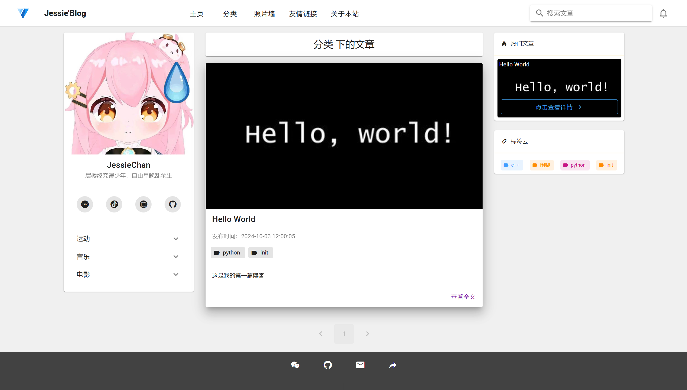
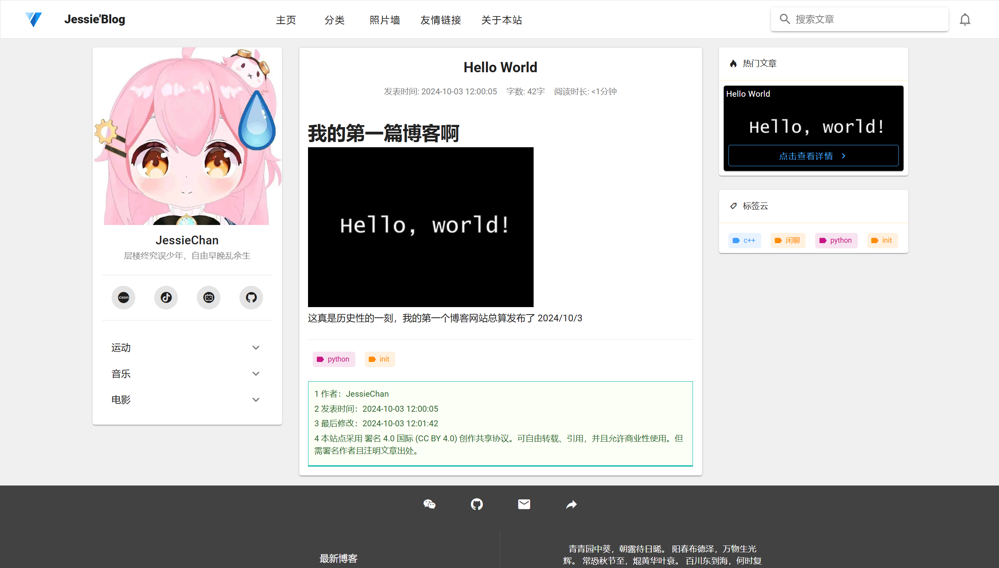
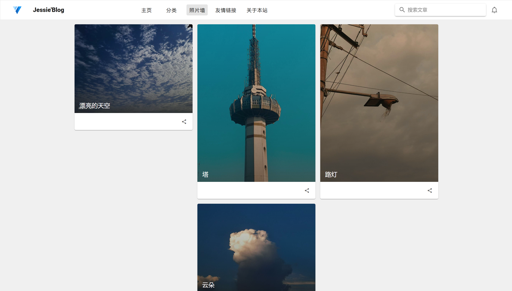
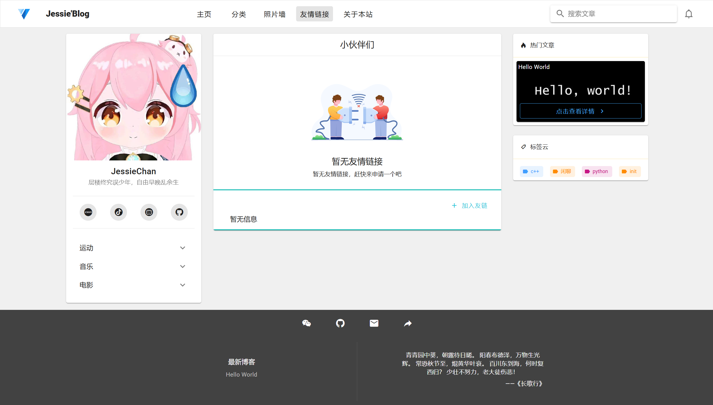

	
    
	
	
	
	
	
	

## 🙂 简介

基于Django5 + vue 开发的博客系统，此仓库为「博客系统的客户端」，目前博客处于起步阶段，很多功能暂未开发，当然此项目会持续维护，大部分功能会在后续版本中更新，如果喜欢的话不妨点个start支持

接口仓库：https://github.com/JessieChan0730/blog-api  
后台仓库：https://github.com/JessieChan0730/blog-admin

## 🔨 相关库与框架

1. vue：[vue](https://github.com/vuejs/vue)
2. vuetify：[vuetify](https://github.com/vuetifyjs/vuetify)
3. axios：[axios](https://github.com/axios/axios)
4. pinia：[pinia](https://github.com/vuejs/pinia)
5. vue-router：[vue-router](https://github.com/vuejs/vue-router)

## 🚀 服务启动

1. 安装依赖 `yarn install`
2. 启动服务 `yarn dev`
3. 在后端服务启动完成的情况下，您可以看到对应的界面

## ✨ 界面展示

## 📈 下一步计划

- [ ] 响应式布局

- [ ] 评论功能

## 🌹 致谢

感谢提供支持的相关开源库和框架，也感谢您对此项目的支持。如果您对此项目还满意，不妨点一个Star，这对我来说很重要

## 📑 License

[MIT](https://github.com/JessieChan0730/blog-view/blob/main/LICENSE)
